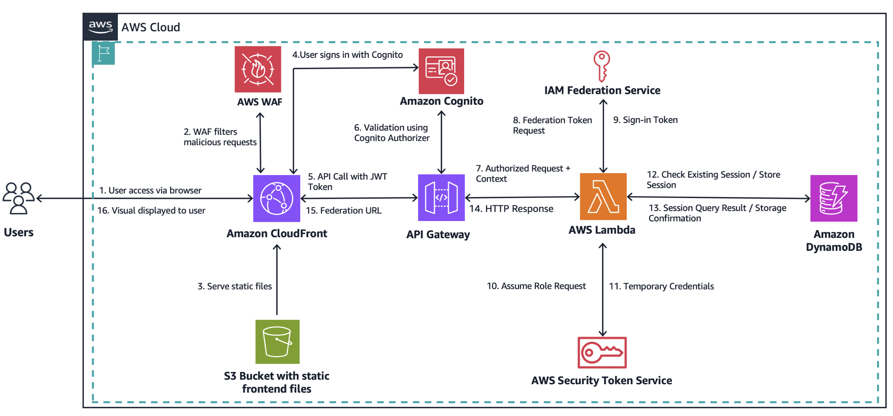

<!--
Copyright Amazon.com, Inc. or its affiliates. All Rights Reserved.
SPDX-License-Identifier: MIT-0
-->

# Marketplace Enterprise Federation Access - Backend

This is the backend infrastructure for the Marketplace Enterprise Federation Access application, built with AWS CDK (Cloud Development Kit) using TypeScript.

## Architecture

<table><tr><td></td></tr></table>

The backend consists of three main CDK stacks:

### AuthStack
- **AWS Cognito User Pool**: User authentication with MFA support
- **Cognito Identity Pool**: Federated identity management
- **User Pool Client**: Web application authentication
- **MFA Configuration**: TOTP-based multi-factor authentication

### APIStack
- **AWS Lambda**: Federation logic and marketplace URL generation
- **API Gateway**: RESTful API with Cognito authorizer
- **DynamoDB**: Session storage with automatic TTL cleanup
- **IAM Roles**: Marketplace access and Lambda execution roles
- **CloudWatch Alarms**: Monitoring for errors and performance

### FrontendStack (Optional)
- **S3 Bucket**: Static website hosting
- **CloudFront Distribution**: Global CDN with HTTPS
- **Automatic Configuration**: Runtime config generation

## Tech Stack

- **AWS CDK** 2.177.0 - Infrastructure as Code
- **TypeScript** 5.0 - Type-safe development
- **AWS SDK v3** - AWS service integration
- **esbuild** - Fast Lambda bundling
- **Jest** - Unit testing framework

## Prerequisites

- **Node.js** 20.x, 22.x, 24.x or higher
- **AWS CLI** configured with appropriate permissions
- **Docker** (for Lambda bundling)
- **CDK CLI** v2.x (`npm install -g aws-cdk`)

## Standalone Backend Deployment

### 1. Install Dependencies

```bash
cd backend
npm install
npm install esbuild  # For local bundling
```

### 2. Configure Environment (Optional)

```bash
# Use local bundling instead of Docker (recommended for M1/M2 Macs)
export CDK_DOCKER=false

# Set your preferred AWS region (optional, defaults to us-east-1)
export CDK_DEPLOY_REGION=eu-west-1  # or us-west-2, ap-southeast-2, etc.
```

### 3. Build and Deploy

```bash
# Build TypeScript
npm run build

# Bootstrap CDK (only needed once per AWS account/region)
npx cdk bootstrap

# Deploy all stacks
npx cdk deploy --all --require-approval never

# Or deploy individual stacks
npx cdk deploy AuthStack
npx cdk deploy APIStack
```

**Multi-Region Deployment:**
- Set `CDK_DEPLOY_REGION` to deploy to any AWS region
- CloudFront WAF automatically deploys to us-east-1 (AWS requirement)
- All other resources deploy to your chosen region
- See [../REGION-DEPLOYMENT.md](../REGION-DEPLOYMENT.md) for detailed guidance

### 4. Get Deployment Outputs

After deployment, note these important outputs:
```bash
# API Gateway URL
APIStack.ApiUrl = https://xxxxxxxxxx.execute-api.region.amazonaws.com/api/

# Cognito Configuration
AuthStack.CognitoUserPoolId = region_xxxxxxxxx
AuthStack.CognitoUserPoolWebClientId = xxxxxxxxxxxxxxxxxxxxxxxxxx
AuthStack.CognitoRegion = region
AuthStack.IdentityPoolId = region:xxxxxxxx-xxxx-xxxx-xxxx-xxxxxxxxxxxx

# Infrastructure ARNs
APIStack.MarketplaceRoleArn = arn:aws:iam::account:role/...
APIStack.LambdaRoleArn = arn:aws:iam::account:role/...
APIStack.UrlsTableName = APIStack-FederationUrlsTable...
```

## Configuration

### Marketplace Product Configuration (S3-based)

Product IDs are now stored in S3 and loaded automatically by the Lambda function. This eliminates the need for environment variables and makes updates easier.

**Configuration File:** `config/marketplace-products.json`

```json
{
  "products": {
    "gitlab": {
      "id": "prodview-vehcu2drxakic",
      "name": "GitLab Premium Self Managed",
      "vendor": "GitLab"
    },
    "okta": {
      "id": "prodview-r4vzqg4bgndda",
      "name": "Okta Platform",
      "vendor": "Okta, Inc"
    }
    // ... more products
  }
}
```

**Benefits:**
- No environment variables needed
- Easy updates without redeployment
- Version controlled configuration
- Automatic S3 upload during deployment
- Lambda caching (5-minute TTL)

### Adding New Products

1. Edit `config/marketplace-products.json`
2. Add the product entry with ID, name, and vendor
3. Update the `ProductType` type in `lambda/marketplace/redirect.ts`
4. Deploy: `npm run deploy`

### Updating Product IDs Without Redeployment

```bash
# Quick update via script
./scripts/update-config.sh

# Or manually
aws s3 cp config/marketplace-products.json s

## API Endpoints

### Base URL
```
https://your-api-gateway-url.amazonaws.com/api/
```

### Endpoints

#### `GET /marketplace-url`
Generate federation URL for marketplace access

**Query Parameters:**
- `product` (required): Product type (`gitlab`, `okta`, `newrelic`, etc.)

**Headers:**
- `Authorization: Bearer <cognito-jwt-token>`

**Response:**
```json
{
  "federationUrl": "https://signin.aws.amazon.com/federation?...",
  "expiresAt": 1640995200
}
```

#### `DELETE /marketplace-url`
Invalidate user sessions

**Headers:**
- `Authorization: Bearer <cognito-jwt-token>`

**Response:**
```json
{
  "message": "Session terminated successfully"
}
```

#### `POST /marketplace-url/revoke`
Revoke all active sessions for the user

**Headers:**
- `Authorization: Bearer <cognito-jwt-token>`

**Response:**
```json
{
  "message": "All sessions revoked successfully",
  "revokedAt": "2023-12-31T12:00:00Z"
}
```

## Testing the Backend

### Unit Tests
```bash
npm test
```

### Manual API Testing

1. **Create a Cognito User:**
```bash
aws cognito-idp admin-create-user \
  --user-pool-id <USER_POOL_ID> \
  --username testuser \
  --user-attributes Name=email,Value=test@example.com \
  --temporary-password TempPass123! \
  --message-action SUPPRESS
```

2. **Test API with curl:**
```bash
# Get JWT token first (use Cognito SDK or frontend)
TOKEN="your-jwt-token"

# Test marketplace URL generation
curl -X GET \
  "https://your-api-gateway-url.amazonaws.com/api/marketplace-url?product=gitlab" \
  -H "Authorization: Bearer $TOKEN"
```

## Troubleshooting

### Common Issues

#### Docker Bundling Errors
```bash
# Solution: Use local bundling
export CDK_DOCKER=false
npm run build
npx cdk deploy --all
```

#### CDK Version Compatibility
```bash
# Update CDK CLI
npm install -g aws-cdk@latest

# Check versions
cdk --version
npm list aws-cdk-lib
```

#### Permission Errors
Ensure your AWS credentials have the following permissions:
- CloudFormation full access
- IAM role creation
- Lambda function management
- API Gateway management
- Cognito management
- DynamoDB management

#### Lambda Function Errors
Check CloudWatch logs:
```bash
aws logs describe-log-groups --log-group-name-prefix "/aws/lambda/APIStack"
aws logs tail "/aws/lambda/APIStack-marketplaceRedirect" --follow
```

## Monitoring

### CloudWatch Metrics
- Lambda invocations: `/aws/lambda/APIStack-marketplaceRedirect`
- API Gateway: `AWS/ApiGateway`
- DynamoDB: `AWS/DynamoDB`

### Alarms
The CDK creates these alarms automatically:
- API Gateway 5XX errors
- Lambda function errors

## Updates and Maintenance

### Updating Lambda Code
```bash
npm run build
npx cdk deploy APIStack
```

### Updating Infrastructure
```bash
# Make changes to CDK code
npm run build
npx cdk diff  # Preview changes
npx cdk deploy --all
```

### Cleaning Up
```bash
# Destroy all resources
npx cdk destroy --all
```

## Integration with Frontend

To integrate with a frontend application, provide these configuration values:

```javascript
// Frontend configuration
const config = {
  apiEndpoint: "https://your-api-gateway-url.amazonaws.com/api/",
  cognito: {
    region: "ap-northeast-1",
    userPoolId: "ap-northeast-1_xxxxxxxxx",
    userPoolWebClientId: "xxxxxxxxxxxxxxxxxxxxxxxxxx",
    identityPoolId: "ap-northeast-1:xxxxxxxx-xxxx-xxxx-xxxx-xxxxxxxxxxxx"
  }
};
```

## Deployment Commands Reference

```bash
# Development
npm run build          # Compile TypeScript
npm run watch          # Watch for changes
npm test              # Run unit tests

# CDK Commands
npx cdk synth         # Generate CloudFormation templates
npx cdk diff          # Compare with deployed stack
npx cdk deploy --all  # Deploy all stacks
npx cdk destroy --all # Delete all stacks

# Specific Stack Deployment
npx cdk deploy AuthStack    # Deploy authentication only
npx cdk deploy APIStack     # Deploy API and Lambda only
```

## Stack Outputs

After successful deployment, you'll receive these outputs that are needed for frontend configuration:

```yaml
AuthStack:
  CognitoRegion: ap-northeast-1
  CognitoUserPoolId: ap-northeast-1_xxxxxxxxx
  CognitoUserPoolWebClientId: xxxxxxxxxxxxxxxxxxxxxxxxxx
  IdentityPoolId: ap-northeast-1:xxxxxxxx-xxxx-xxxx-xxxx-xxxxxxxxxxxx

APIStack:
  ApiUrl: https://xxxxxxxxxx.execute-api.ap-northeast-1.amazonaws.com/api/
  MarketplaceRoleArn: arn:aws:iam::account:role/APIStack-MarketplaceRole...
  LambdaRoleArn: arn:aws:iam::account:role/APIStack-MarketplaceRedirectRole...
  UrlsTableName: APIStack-FederationUrlsTable...
```

Save these outputs as they're required for frontend configuration!

## Project Structure

```
backend/
├── bin/
│   └── backend.ts              # CDK app entry point
├── lib/
│   ├── auth-stack.ts           # Cognito authentication stack
│   ├── api-stack.ts            # API Gateway and Lambda stack
│   └── frontend-stack.ts       # S3 and CloudFront stack
├── lambda/
│   └── marketplace/
│       └── redirect.ts         # Federation logic
├── config/
│   └── marketplace-products.json # Product configuration
├── scripts/
│   └── update-config.sh        # Configuration update script
├── test/
│   └── *.test.ts              # Unit tests
├── cdk.json                    # CDK configuration
├── tsconfig.json               # TypeScript configuration
└── package.json                # Dependencies and scripts
```

## IAM Roles and Permissions

### Lambda Execution Role
```json
{
  "Effect": "Allow",
  "Action": [
    "logs:CreateLogGroup",
    "logs:CreateLogStream",
    "logs:PutLogEvents",
    "dynamodb:PutItem",
    "dynamodb:GetItem",
    "dynamodb:DeleteItem",
    "dynamodb:Query",
    "sts:AssumeRole",
    "s3:GetObject"
  ]
}
```

### Marketplace Role
```json
{
  "Effect": "Allow",
  "Action": [
    "aws-marketplace:ViewSubscriptions",
    "aws-marketplace:Subscribe",
    "aws-marketplace:Unsubscribe"
  ]
}
```

### Cognito Authenticated Role
```json
{
  "Effect": "Allow",
  "Action": [
    "execute-api:Invoke"
  ],
  "Resource": "arn:aws:execute-api:*:*:*/*/GET/marketplace-url"
}
```

## Session Management

### DynamoDB Schema

**Table Name**: `APIStack-FederationUrlsTable`

**Primary Key**: `userId` (String) - Format: `{cognitoUsername}#{productType}`

**Attributes**:
```json
{
  "userId": "user@example.com#gitlab",
  "federationUrl": "https://signin.aws.amazon.com/federation?...",
  "expirationTime": 1640995200,
  "username": "user@example.com",
  "productType": "gitlab",
  "createdAt": "2023-12-31T12:00:00Z",
  "lastAccessed": "2023-12-31T12:00:00Z",
  "ttl": 1640995200
}
```

**TTL**: Automatic cleanup after 1 hour

### Session Lifecycle

1. **Creation**: User requests marketplace access
2. **Storage**: Session stored in DynamoDB with TTL
3. **Federation**: STS generates temporary credentials
4. **Access**: User redirected to marketplace with federated session
5. **Cleanup**: Automatic deletion via TTL or manual logout

## Testing

### Unit Tests

```bash
# Run all tests
npm test

# Run with coverage
npm test -- --coverage

# Run specific test file
npm test -- auth-stack.test.ts
```

### Integration Testing

```bash
# Deploy to test environment
npx cdk deploy --all --context environment=test

# Run integration tests
npm run test:integration
```

### Load Testing

```bash
# Use Artillery or similar tool
artillery quick --count 100 --num 10 \
  "https://your-api-gateway-url.amazonaws.com/api/marketplace-url?product=gitlab"
```

## Monitoring and Logging

### CloudWatch Log Groups

- `/aws/lambda/APIStack-marketplaceRedirect` - Lambda function logs
- `/aws/apigateway/APIStack` - API Gateway access logs

### Viewing Logs

```bash
# Tail Lambda logs
aws logs tail "/aws/lambda/APIStack-marketplaceRedirect" --follow

# Filter for errors
aws logs filter-log-events \
  --log-group-name "/aws/lambda/APIStack-marketplaceRedirect" \
  --filter-pattern "ERROR"

# Get recent invocations
aws logs tail "/aws/lambda/APIStack-marketplaceRedirect" --since 1h
```

### CloudWatch Metrics

```bash
# Lambda invocations
aws cloudwatch get-metric-statistics \
  --namespace AWS/Lambda \
  --metric-name Invocations \
  --dimensions Name=FunctionName,Value=APIStack-marketplaceRedirect \
  --start-time 2023-12-31T00:00:00Z \
  --end-time 2023-12-31T23:59:59Z \
  --period 3600 \
  --statistics Sum

# API Gateway requests
aws cloudwatch get-metric-statistics \
  --namespace AWS/ApiGateway \
  --metric-name Count \
  --dimensions Name=ApiName,Value=MarketplaceFederationAPI \
  --start-time 2023-12-31T00:00:00Z \
  --end-time 2023-12-31T23:59:59Z \
  --period 3600 \
  --statistics Sum
```

### Custom Alarms

The CDK automatically creates these alarms:

1. **API Gateway 5XX Errors**
   - Threshold: > 5 errors in 5 minutes
   - Action: SNS notification (if configured)

2. **Lambda Function Errors**
   - Threshold: > 3 errors in 5 minutes
   - Action: SNS notification (if configured)

3. **DynamoDB Throttling**
   - Threshold: > 10 throttled requests
   - Action: Auto-scaling trigger

## 🔧 Advanced Configuration

### Custom Domain

```typescript
// In api-stack.ts
const api = new apigateway.RestApi(this, 'MarketplaceFederationAPI', {
  domainName: {
    domainName: 'api.yourdomain.com',
    certificate: certificate,
  },
});
```

### VPC Configuration

```typescript
// In api-stack.ts
const lambda = new lambda.Function(this, 'MarketplaceRedirect', {
  vpc: vpc,
  vpcSubnets: { subnetType: ec2.SubnetType.PRIVATE_WITH_EGRESS },
  securityGroups: [securityGroup],
});
```

### Environment-Specific Deployment

```bash
# Development
npx cdk deploy --all --context environment=dev

# Staging
npx cdk deploy --all --context environment=staging

# Production
npx cdk deploy --all --context environment=prod
```

## CI/CD Integration

### GitHub Actions Example

```yaml
name: Deploy Backend
on:
  push:
    branches: [main]
    paths:
      - 'backend/**'

jobs:
  deploy:
    runs-on: ubuntu-latest
    steps:
      - uses: actions/checkout@v3
      - uses: actions/setup-node@v3
        with:
          node-version: '18'
      - name: Install dependencies
        run: |
          cd backend
          npm ci
      - name: Run tests
        run: |
          cd backend
          npm test
      - name: Deploy to AWS
        run: |
          cd backend
          npx cdk deploy --all --require-approval never
        env:
          AWS_ACCESS_KEY_ID: ${{ secrets.AWS_ACCESS_KEY_ID }}
          AWS_SECRET_ACCESS_KEY: ${{ secrets.AWS_SECRET_ACCESS_KEY }}
          AWS_REGION: ap-northeast-1
```

## Security Best Practices

1. **Least Privilege IAM**: Roles have minimal required permissions
2. **Encryption**: All data encrypted at rest and in transit
3. **MFA Enforcement**: Required for all Cognito users
4. **API Authorization**: Cognito JWT validation on all endpoints
5. **Session Expiry**: 1-hour TTL on all sessions
6. **CloudWatch Monitoring**: Real-time error and security alerts
7. **VPC Isolation**: Lambda can be deployed in private subnets
8. **Secrets Management**: Use AWS Secrets Manager for sensitive data

## Backup and Disaster Recovery

### DynamoDB Backups

```bash
# Enable point-in-time recovery
aws dynamodb update-continuous-backups \
  --table-name APIStack-FederationUrlsTable \
  --point-in-time-recovery-specification PointInTimeRecoveryEnabled=true

# Create on-demand backup
aws dynamodb create-backup \
  --table-name APIStack-FederationUrlsTable \
  --backup-name marketplace-federation-backup-$(date +%Y%m%d)
```

### Stack Exports

```bash
# Export CloudFormation template
npx cdk synth > cloudformation-template.yaml

# Save stack outputs
aws cloudformation describe-stacks \
  --stack-name AuthStack \
  --query 'Stacks[0].Outputs' > auth-stack-outputs.json
```

## Performance Optimization

### Lambda Optimization

- **Memory**: 512 MB (adjust based on usage)
- **Timeout**: 30 seconds
- **Provisioned Concurrency**: Optional for consistent performance
- **Code Bundling**: esbuild for fast cold starts

### DynamoDB Optimization

- **On-Demand Billing**: Automatic scaling
- **TTL**: Automatic cleanup reduces storage costs
- **Indexes**: GSI for efficient queries (if needed)

### API Gateway Optimization

- **Caching**: Enable for GET requests
- **Throttling**: 10,000 requests per second
- **Compression**: Automatic response compression

## Cleanup

### Complete Cleanup

```bash
# Destroy all stacks
npx cdk destroy --all --force

# Delete CloudWatch log groups
aws logs delete-log-group --log-group-name /aws/lambda/APIStack-marketplaceRedirect

# Delete S3 buckets (if not auto-deleted)
aws s3 rb s3://your-bucket-name --force

# Delete CDK bootstrap (optional)
aws cloudformation delete-stack --stack-name CDKToolkit
```

## Contributing

1. Fork the repository
2. Create a feature branch
3. Make your changes
4. Add tests for new functionality
5. Run `npm test` and `npm run build`
6. Submit a pull request

## License

This project is licensed under the MIT License.

## Support

For issues and questions:
1. Check CloudWatch logs for errors
2. Review IAM permissions
3. Verify CDK version compatibility
4. Check AWS service quotas
5. Review the troubleshooting section above
