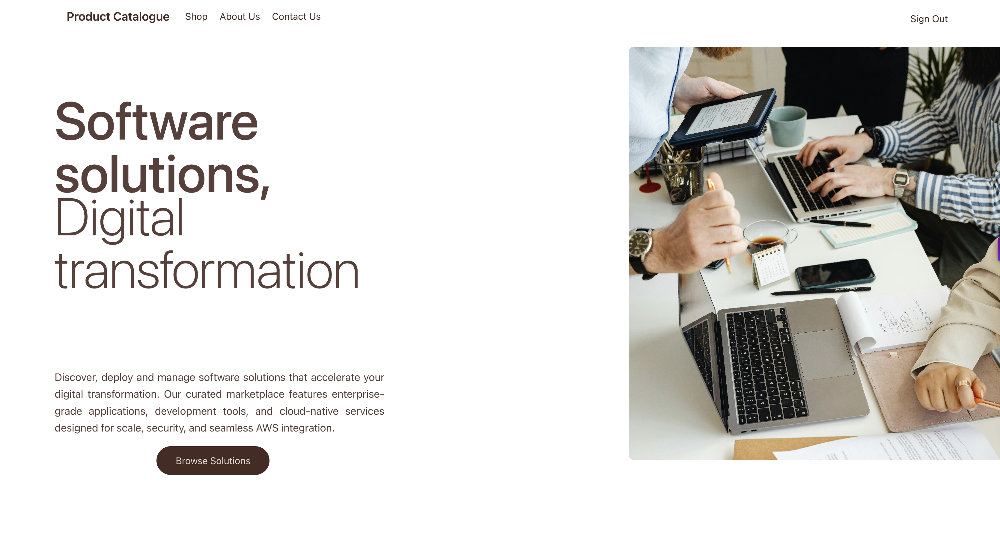
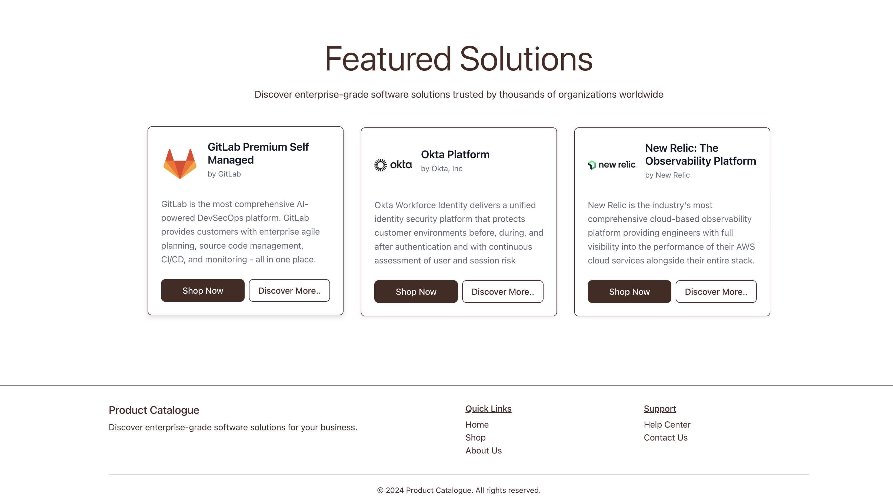

<!--
Copyright Amazon.com, Inc. or its affiliates. All Rights Reserved.
SPDX-License-Identifier: MIT-0
-->

# Marketplace Enterprise Federation Access - Frontend

A modern React application built with Vite and AWS Cloudscape Design System that provides a secure interface for accessing AWS Marketplace products through federated authentication.

## Website


<table><tr><td></td></tr></table>

<table><tr><td></td></tr></table>

## Features

- **Modern React Stack**: Built with React 19 and Vite for fast development
- **AWS Cloudscape UI**: Professional AWS-native design system
- **Secure Authentication**: AWS Amplify integration with Cognito
- **MFA Support**: Multi-factor authentication with TOTP
- **Responsive Design**: Mobile-friendly interface
- **Session Management**: Automatic session handling and cleanup
- **Loading States**: Per-product loading indicators
- **Error Handling**: Graceful error handling with user feedback

## Tech Stack

- **React 19** - UI framework
- **Vite** - Build tool and dev server
- **AWS Amplify** - Authentication and API integration
- **AWS Cloudscape** - Design system components
- **React Bootstrap** - Additional UI components
- **Motion** - Animation library

## Prerequisites

- **Node.js** 20.x, 22.x, 24.x or higher
- **npm** or **yarn** package manager
- **Backend deployed** - API Gateway and Cognito must be deployed first

## Quick Start - Automatic Configuration

The frontend is automatically configured during deployment. No manual setup required!

### For Production Deployment

```bash
# 1. Deploy backend
cd ../backend
npm install
npm run deploy

# 2. Build frontend
cd ../frontend
npm install
npm run build

# 3. Deploy (config.js is automatically generated and uploaded)
cd ../backend
npm run deploy
```

### For Local Development

```bash
# 1. Deploy backend (this generates .env.local automatically)
cd ../backend
npm run deploy

# 2. Run dev server
cd ../frontend
npm run dev
```

## How Configuration Works

### Production
- CDK automatically generates `config.js` with correct values
- Uploads it to S3 during deployment
- CloudFront serves it at `/config.js`
- Frontend loads it from the network tab at runtime

### Local Development
- CDK automatically generates `.env.local` during backend deployment
- Vite uses these environment variables
- No manual configuration needed

## Manual Configuration (If Needed)

If automatic configuration doesn't work, use the helper script:

```bash
cd ..
./configure.sh
```

## Important Files

- `public/config.js` - Template file (actual config is generated by CDK)
- `.env.local` - Auto-generated by CDK for local development
- `.env.template` - Template for reference

## Security Notes

- `.env.local` is in `.gitignore` and not committed
- Production `config.js` is generated at deployment time
- No sensitive values are stored in the repository

## Project Structure

```
frontend/
├── public/
│   ├── config.js          # Runtime configuration (auto-generated)
│   └── vite.svg
├── src/
│   ├── components/        # React components
│   │   ├── Auth.jsx      # Authentication wrapper
│   │   ├── Header.jsx    # Application header
│   │   └── ProductCard.jsx # Product display cards
│   ├── config/
│   │   └── amplify.js    # Amplify configuration
│   ├── services/
│   │   └── api.js        # API service layer
│   ├── App.jsx           # Main application component
│   ├── App.css           # Application styles
│   └── main.jsx          # Application entry point
├── .env.local            # Local development config (auto-generated)
├── .env.template         # Template for reference
├── index.html            # HTML entry point
├── package.json          # Dependencies and scripts
└── vite.config.js        # Vite configuration
```

## Available Scripts

```bash
# Development
npm run dev              # Start development server (http://localhost:5173)
npm run build            # Build for production
npm run preview          # Preview production build locally

# Code Quality
npm run lint             # Run ESLint
```

## Environment Variables

### Local Development (.env.local)
```bash
VITE_API_ENDPOINT=https://your-api-gateway-url.amazonaws.com/api/
VITE_COGNITO_REGION=ap-northeast-1
VITE_COGNITO_USER_POOL_ID=ap-northeast-1_xxxxxxxxx
VITE_COGNITO_USER_POOL_WEB_CLIENT_ID=xxxxxxxxxxxxxxxxxxxxxxxxxx
```

### Production (public/config.js)
```javascript
window.APP_CONFIG = {
  apiEndpoint: 'https://your-api-gateway-url.amazonaws.com/api/',
  cognito: {
    region: 'ap-northeast-1',
    userPoolId: 'ap-northeast-1_xxxxxxxxx',
    userPoolWebClientId: 'xxxxxxxxxxxxxxxxxxxxxxxxxx'
  }
};
```

## Customization

### Adding New Products

1. Update the products array in `src/App.jsx`:
```javascript
const products = [
  {
    id: 'your-product',
    name: 'Your Product Name',
    vendor: 'Vendor Name',
    description: 'Product description',
    category: 'Category',
    icon: '🚀'
  }
];
```

2. Ensure the backend supports the new product type

### Styling

- Global styles: `src/App.css`
- Cloudscape theme: Automatically applied
- Custom components: Use Cloudscape components for consistency

## Troubleshooting

### Development Server Won't Start

```bash
# Clear node_modules and reinstall
rm -rf node_modules package-lock.json
npm install
npm run dev
```

### Configuration Not Loading

```bash
# Check if .env.local exists
ls -la .env.local

# Regenerate configuration
cd ../backend
npm run deploy
```

### CORS Errors

Ensure your API Gateway has CORS enabled. The backend CDK automatically configures this.

### Build Errors

```bash
# Clear Vite cache
rm -rf node_modules/.vite
npm run build
```

## Deployment

### Option 1: AWS S3 + CloudFront (Recommended)

```bash
# Build the application
npm run build

# Deploy to S3 (if using CDK FrontendStack)
cd ../backend
npx cdk deploy FrontendStack

# Or manually sync to S3
aws s3 sync dist/ s3://your-bucket-name --delete
aws cloudfront create-invalidation --distribution-id YOUR_DIST_ID --paths "/*"
```

### Option 2: Static Hosting

```bash
# Build the application
npm run build

# The dist/ folder contains all static files
# Deploy to any static hosting service:
# - Vercel
# - Netlify
# - AWS Amplify Hosting
# - GitHub Pages
```

## Testing

### Manual Testing Checklist

- [ ] User registration and login
- [ ] MFA setup and verification
- [ ] Product card display
- [ ] "Shop Now" button functionality
- [ ] Loading states per product
- [ ] Session persistence
- [ ] Logout functionality
- [ ] Error handling
- [ ] Responsive design on mobile

### Browser Compatibility

- Chrome 109+
- Firefox 132+
- Safari 18+
- Edge 131+

## Performance

- **First Load**: ~500KB (gzipped)
- **Lighthouse Score**: 90+
- **Build Time**: ~10 seconds
- **Hot Reload**: <100ms

## Security Best Practices

1. **Never commit** `.env.local` or sensitive credentials
2. **Use HTTPS** in production
3. **Enable MFA** for all users
4. **Rotate credentials** regularly
5. **Monitor CloudWatch** logs for suspicious activity

## Contributing

1. Follow the existing code style
2. Use Cloudscape components when possible
3. Test on multiple browsers
4. Update documentation for new features

## License

This project is licensed under the MIT License.

## Support

For issues and questions:
1. Check the troubleshooting section
2. Review browser console for errors
3. Verify backend API is running
4. Check network tab for failed requests
